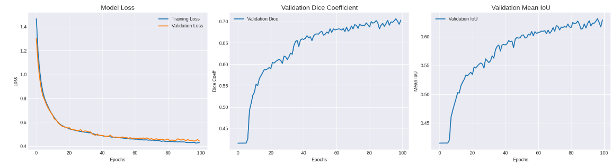
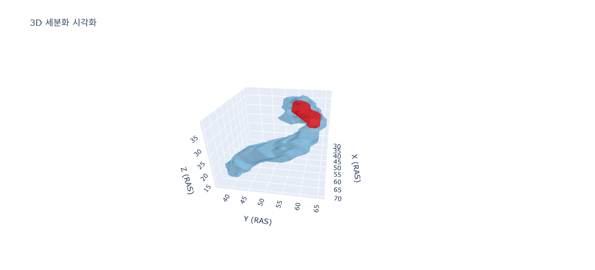

# CT 기반 3D 췌장암 분할 (Pancreatic Cancer Segmentation)

[](https://pytorch.org/)
[](https://monai.io/)
[](https://plotly.com/)

> **Medical Segmentation Decathlon (MSD) 데이터를 활용하여, 췌장(Pancreas)과 종양(Tumor) 영역을 분할하는 3D U-Net 모델을 개발하고 3D 시각화로 결과를 확인하는 프로젝트입니다.**

---

## 1. 프로젝트 개요

-   **목표**: CT 영상에서 췌장과 종양 영역을 정밀하게 분할하는 3D Semantic Segmentation 모델 구축
-   **데이터**:
    -   **췌장암 (Cancer)**: Medical Segmentation Decathlon (MSD) - Task07_Pancreas (281건)
    -   **정상 (Normal)**: 자체 확보 데이터 (t1.zip, 385건)
-   **핵심 성과**:
    -   최종 검증 데이터셋에서 **평균 Dice Score 0.7062** 달성 (at 96 epoch)
    -   Plotly를 이용해 분할된 췌장과 종양 영역의 **인터랙티브 3D Mesh 시각화** 구현 및 HTML 저장 기능 개발

---

## 2. 모델 아키텍처 및 학습 전략

### 2.1. Custom 3D U-Net

본 프로젝트에서는 의료 영상 분할에 특화된 **3D U-Net 아키텍처를 `PyTorch`와 `MONAI`를 기반으로 직접 구현**했습니다.

-   **구조**: 3D Convolution 기반의 Encoder-Decoder 구조와 Skip-connection을 통해 다중 스케일의 공간적 특징을 효과적으로 학습합니다.
-   **활성화 함수**: `LeakyReLU`를 사용하여 Dying ReLU 문제를 방지했습니다.
-   **손실 함수**: `DiceCELoss`를 사용하여, Dice Loss와 Cross-Entropy Loss의 장점을 결합해 영역 분할의 정확도와 안정성을 동시에 확보했습니다.

### 2.2. 데이터 전처리 및 증강

`MONAI`의 강력한 Transform 파이프라인을 활용하여 데이터 처리의 효율성과 모델의 강건성을 높였습니다.

-   **주요 전처리**: `NIfTI` 데이터 로드, `RAS` 방향 통일, HU 값 정규화, `CropForegroundd` 배경 제거, (64, 96, 96) 해상도 통일
-   **데이터 증강**: `RandFlipd`, `RandRotate90d`, `RandShiftIntensityd` 등을 적용하여 모델의 일반화 성능 향상
-   **클래스 불균형 해소**: 암 데이터 **오버샘플링(Oversampling)** 적용

---

## 3. 결과 및 시각화

### 3.1. 학습 결과

총 100 Epoch 학습 과정에서 **96번째 Epoch**에서 최고 성능인 **평균 Dice Score 0.7062**를 기록했습니다. `ReduceLROnPlateau` 스케줄러를 통해 학습 안정성을 높였고, `Early Stopping`으로 과적합을 방지했습니다.

<p align="center">
  
</p>

### 3.2. 3D 분할 결과 시각화

추론된 마스크 결과를 `skimage`의 `marching_cubes` 알고리즘과 `Plotly`를 이용해 인터랙티브 3D 시각화를 구현했습니다. 이 결과는 독립적인 **HTML 파일로 저장**하여 공유할 수 있습니다.

<p align="center">
  
</p>

---

## 4. 사용 방법

### Repository 클론
```bash
git clone [https://github.com/SHowoSH/pancreatic-cancer-segmentation.git](https://github.com/SHowoSH/pancreatic-cancer-segmentation.git)
cd pancreatic-cancer-segmentation

필요 라이브러리 설치
Bash

pip install -r requirements.txt
학습 실행
pancreatic-cancer-segmentation-training.ipynb 노트북 파일의 데이터 경로(DRIVE_BASE_PATH)를 수정한 후 실행합니다.

추론 및 3D 시각화
3d-visualization-and-inference.ipynb 노트북 파일의 모델 및 데이터 경로를 수정한 후 실행하면, pancreas_3d_visualization.html 파일이 생성됩니다.